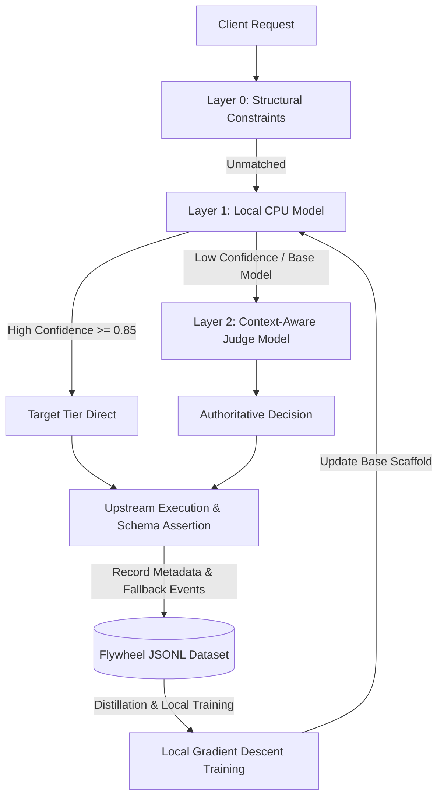

# ADR-0004: Hierarchical Classification Architecture & Active Learning Data Flywheel

## Status
Accepted & Implemented - 2026-09-29

## Context
As traffic volume grows and query semantics diversify, relying solely on shallow structural rules encounters architectural ceilings:
1. **Implicit Complex Semantics**: Queries lacking formal math formulas or code blocks may still demand high-tier thinking (e.g., philosophical dilemmas, concurrency traps described in prose).
2. **Latency vs. Accuracy Trade-offs**:
   - Structural rule matching takes `<0.05ms`, but exhibits coarse boundaries;
   - Autoregressive generative LLMs (e.g., GPT-4o-mini) as judges are slow (1000ms+), prone to schema hallucinations, and consume billable tokens;
   - Local lightweight CPU models (0.1~1ms) provide ideal high-throughput filtering, but require bootstrapping and training data.
3. **Data Flywheel Feedback Loop**: Production gateways process real traffic and generate definitive ground-truth feedback signals (such as cascading schema validation failures). These signals should be harnessed into an automated evolutionary flywheel.

## Decision
Design and implement a **Hierarchical Decision Pipeline** paired with an **Active Learning Data Flywheel**:

### 1. Hierarchical Classification Pipeline
- **Layer 0: Deterministic Structural Rules**
  - Instantaneous bypass for explicit protocol parameters (`json_schema`, `tools`), taking `<0.02ms`.
- **Layer 1: Local Micro-Tensor / ONNX Model with Confidence Gating**
  - Runs locally on CPU via micro-tensor linear softmax or ONNX runtime (`0.1~1ms` inference, zero token cost).
  - **Confidence Gating**: The model outputs calibrated softmax probabilities. When $\max(P) \ge \text{threshold}$ (e.g., 0.85), it routes immediately; otherwise, it cascades gracefully to Layer 2.
- **Layer 2: Dedicated Context-Aware Judge Model (TypeSafe Jev / OpenCode Proxy)**
  - Invokes a non-autoregressive decision model equipped with recent dialogue history turns.
  - Generates type-safe tier decisions with calibrated confidence metrics, eliminating generation formatting errors.
- **Layer 3: Runtime Execution & Cascading Assertion (Fallback Engine)**
  - lite tier model attempts execution -> Local AST / JSON schema assertion.
  - Upon assertion failure, silently escalates to plus tier and records a negative training sample.

### 2. Active Learning Data Flywheel

- **Ground Truth Signal Collection**:
  - **Negative Samples**: When lite tier execution fails schema assertions triggering fallback, the query is marked as a definitive negative sample for lite tier.
  - **Teacher Labels**: Authoritative decisions from Layer 2 act as distillation labels.
  - **Positive Samples**: Unprompted queries cleanly satisfied on lite tier.
- **Continuous In-Place Evolution**:
  - The local micro-tensor base model is updated periodically via `bun run train:layer1`.
  - Goal: Absorb >90% of recurring traffic at Layer 1 (<0.1ms, $0 cost), reducing Layer 2 invocations to <10%.

## Consequences
- **Positive**:
  - Balanced trade-off between sub-millisecond local latency and plus-tier accuracy.
  - Creates a self-improving, proprietary optimization flywheel from production traffic.
