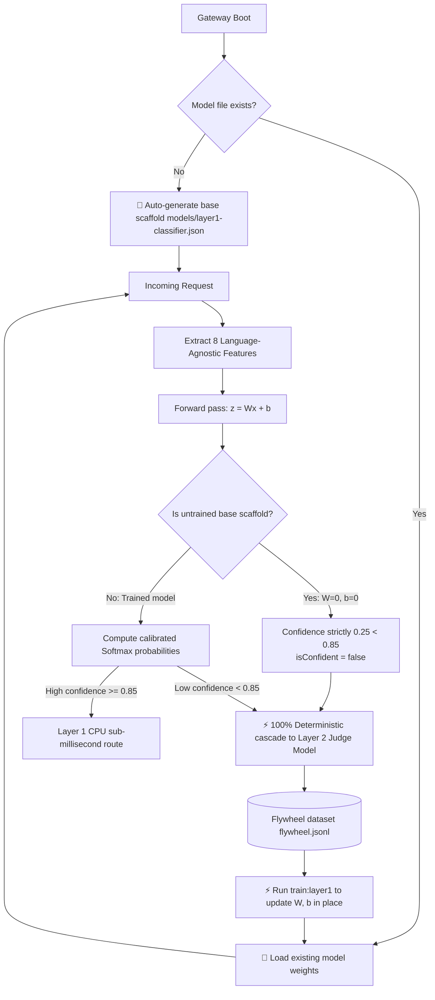

# ADR-0005: Auto-Initializing Local Base Model Scaffold and Deterministic Cascade

## Status
Accepted & Implemented - 2026-09-29

## Context
In enforcing our core design principle: **"Purge all hardcoded rules, rely strictly on model-driven routing, and maintain 100% language neutrality (i18n)"**, a critical challenge arose during the cold-start phase:
1. **Physical Entity vs. Dummy Branching**: If Layer 1 is merely a stub (`if (!file) return false`), the architecture lacks a tangible model engine, impeding continuous training and uniform runtime pipelines.
2. **Rejection of Character-Count or Token Heuristics**: Ultra-short queries (e.g., `P=NP?`, "prove Fermat's theorem") often demand supreme thinking power, whereas long logs may be trivial to parse. Using token or character counts to bypass models is inherently flawed.
3. **Guaranteed Deterministic Fallthrough**: The system requires an auto-generated, validly formatted micro-tensor model scaffold that can execute real forward inference, but whose untrained mathematical output produces confidence guaranteed to be below threshold, deterministically cascading 100% to Layer 2 (Context-Aware Judge / OpenCode proxy).

## Decision

### 1. Micro-Tensor Base Model Specification
A lightweight CPU micro-tensor model stored in portable JSON format, completely free of native C++ binary bindings:
- **Feature Dimensions**: 8 language-agnostic numerical & statistical structural features:
  1. `token_count_normalized`: Logarithmic token scale
  2. `turn_count_normalized`: Dialogue depth
  3. `has_system_prompt`: System role existence flag (0/1)
  4. `code_block_ratio`: Markdown fence character density
  5. `syntax_symbol_density`: Programming syntax density (`{}<>=;`)
  6. `has_tools_or_schema`: Structured output protocol flag
  7. `character_entropy`: Shannon character entropy (distinguishes code/math from dialogue)
  8. `punctuation_density`: Sentence punctuation density
- **Untrained Base Scaffold State**:
  - `isBaseModel: true`
  - `sampleCount: 0`
  - Weight matrix $W \in \mathbb{R}^{8 \times 4} = \mathbf{0}$
  - Bias vector $b \in \mathbb{R}^4 = \mathbf{0}$

### 2. Auto-Initialization on Gateway Boot
When the gateway starts up:
1. Checks for the presence of `./models/layer1-classifier.json`;
2. If missing, automatically creates the directory and writes the default base scaffold;
3. Logs: `[Layer1Classifier] Auto-initialized empty base model scaffold: ./models/layer1-classifier.json`;
4. Mounts into memory, immediately ready for forward-pass execution.

### 3. Mathematical Proof of Deterministic Fallthrough
For the untrained base scaffold, the forward logits are:
$$z = W^T x + b = \mathbf{0}$$
$$\text{Softmax}(z) = \left[\frac{e^0}{4}, \frac{e^0}{4}, \frac{e^0}{4}, \frac{e^0}{4}\right] = [0.25, 0.25, 0.25, 0.25]$$
- Maximum probability is $0.25$;
- Standard confidence threshold is $\theta = 0.85$;
- Because $0.25 < 0.85$, `isConfident` evaluates to **strictly `false` with mathematical certainty**;
- Safe baseline quality defaults to `targetTier: 'plus'` (preventing premature down-scaling on short queries);
- `routeAsync` inspects `!isConfident` and **100% cascades deterministically to Layer 2**.

### 4. Active In-Place Flywheel Evolution
The base scaffold is a living artifact:
- Layer 2 decisions and runtime validation events are logged to `data/flywheel.jsonl`;
- Running `bun run train:layer1` performs in-place gradient descent on $W$ and $b$, setting `isBaseModel: false`;
- The trained empirical model achieves confidence $>0.85$ on frequent patterns, taking over routing on CPU (<0.1ms) with zero external API calls.

## Consequences
- **Positive**:
  - Completely eliminates token length thresholds and natural language lexicons.
  - Zero hardcoded bypasses: cold-start traffic flows through a mathematically rigorous model evaluation.
  - Out-of-the-box ready on all operating systems without requiring compilation tools.
