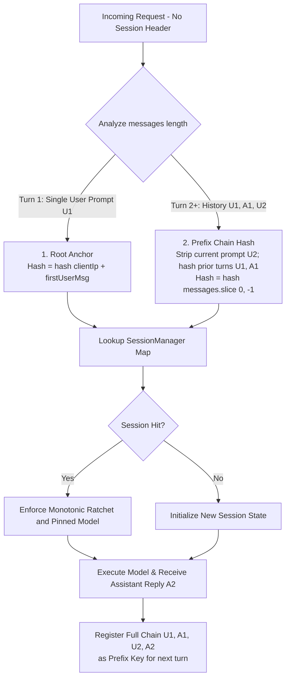

# ADR-0006: Monotonic Session Ratchet and Zero-Header Prefix Fingerprinting

## Status
Accepted & Implemented - 2026-09-29

## Context
Routing multi-turn chat conversations in an LLM gateway introduces two severe failure modes:
1. **Intellectual Degradation via Mid-Session Down-Scaling**:
   - Turn 1: The user requests designing a distributed Paxos consensus algorithm.
   - Turn 2: The user asks a short follow-up: *"OK, why add 1 on line 3?"*.
   - If evaluated statelessly in isolation, Turn 2 looks trivial and gets routed to a micro lite tier model. Incapable of parsing thousands of preceding code tokens, lite tier hallucinates catastrophically.
2. **Upstream Prompt Caching (KV Cache) Invalidation**:
   - Leading LLMs (Claude, DeepSeek, Kimi, OpenAI) support KV Prompt Caching, yielding 80%~95% hit rates and 5x~10x cost reductions;
   - Switching models or providers mid-conversation immediately evicts the upstream KV cache. The client is forced to pay full price for prefilling 10k+ historical tokens on the new model, erasing FinOps savings and causing latency spikes.
3. **Stateless Clients without Sticky Session Headers**:
   - OpenAI protocol clients (Chatbox, NextChat, OpenWebUI, Cursor, official SDKs) send only a stateless `messages` array without custom `x-session-id` headers.

## Decision

### 1. Monotonic Session Ratchet Strategy
Enforce an **"Escalate-Only + Pinned Model Instance"** policy:
- **Tier Ranking**: $\text{Rank}(\text{lite}) = 1 < \text{Rank}(\text{plus}) = 2 < \text{Rank}(\text{pro}) = 3 < \text{Rank}(\text{ultra}) = 4$;
- **Escalation Allowed**:
  - When the proposed tier for a turn exceeds the session's historical peak ($T_{\text{proposed}} > T_{\text{session}}$), upgrade tier and pin the new model instance;
- **Downgrade Blocked (Ratchet Lock)**:
  - When a subsequent short prompt proposes a lower tier ($T_{\text{proposed}} \le T_{\text{session}}$), **strictly lock to the session's peak tier**;
  - **Key FinOps Guarantee**: Reuses the exact same physical model ID (`session.pinnedModel`), guaranteeing 100% upstream KV cache hit rate.

### 2. Dual Zero-Header Fingerprinting (Prefix Chain & Root Anchor)
Achieves collision-free session tracking without client-side modifications:

- **Prefix Chain Hash**: For Turn 2+, stripping the newest user prompt leaves the prior history, which contains the previous assistant response generated by the LLM. Because model-generated responses are verbose and unique, hash collisions are mathematically 0.
- **Root Anchor**: For Turn 1 cold starts, combines client network identity (IP / Auth Token) with first user prompt content.
- **Post-Turn Registration**: Upon turn completion, the full chain including new assistant tokens is indexed, ensuring the subsequent turn matches instantaneously.

## Consequences
- **Positive**:
  - Eliminates intellectual degradation from short follow-up questions.
  - Locks conversations to the same physical provider model, **maximizing KV prompt caching discounts (80%-95% savings)**.
  - Transparently compatible with all third-party OpenAI Web UIs and SDKs.
  - Introduces inspection endpoint `GET /v1/sessions` for operational observability.
