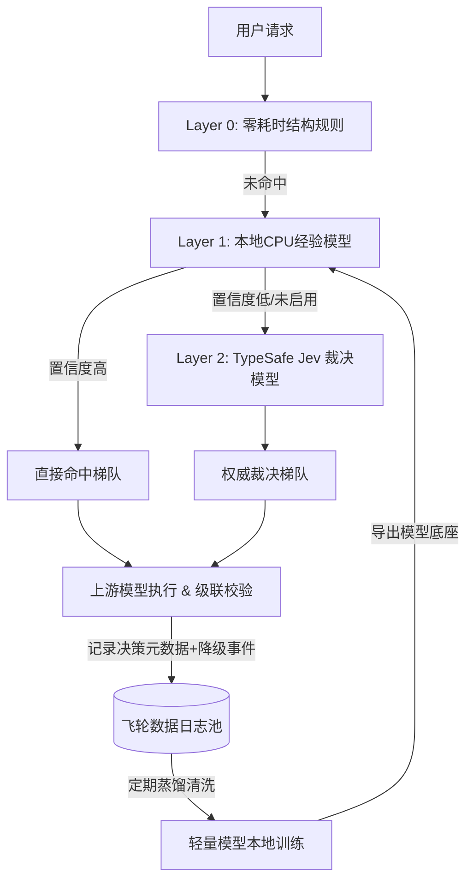

# ADR-0004: 多层分类架构与数据飞轮演进体系

## 状态
已接受并实现 (Accepted & Implemented) - 2026-09-29
2026-10-10 更新：Lite/Plus/Pro/Ultra 4 档命名（之前为 fast/flagship/reasoning 3 档），新增 Ultra 档

## 上下文 (Context)
随着流量规模扩大与使用场景复杂化，现有的 Layer 0（纯结构语法与正则启发式）面临以下长期诉求：
1. **隐式复杂语义的识别**：部分提问无特殊标点或代码块，但涉及深层逻辑陷阱（如"先有鸡还是先有蛋"、"某段逻辑为什么会发生死锁但不用代码展示"），难以仅靠规则准确分类。
2. **时延与精度的权衡**：
   - 规则匹配耗时 `<0.05ms`，但边界模糊；
   - 生成式大模型（如 GPT-4o-mini）做分类准确度尚可，但受制于自回归生成慢（1000ms+）、易格式崩塌、且消耗 Token 成本；
   - 本地微型小模型（CPU 运行，1~5ms）适合做高频过滤，但冷启动缺少训练数据。
3. **数据飞轮沉淀诉求**：网关每天都在处理大量的请求、并拥有天然的"级联降级失败"真实反馈信号，应当将这些信号沉淀为资产，形成自演进的飞轮机制。

## 决策 (Decision)
设计并分阶段推进"四层级联决策架构"与"数据飞轮体系"：

### 1. 四层分层路由架构 (Hierarchical Classification Pipeline)
- **Layer 0: 快速短路层 (Lite Structural Rules)**
  - 维持当前实现：基于长度、LaTeX 公式、空 payload 等规则，耗时 `<0.05ms`。
  - 拦截约 20%~30% 的极简单或极复杂特征请求。
- **Layer 1: 本地经验小模型层 (Local CPU Model with Confidence Gating)**
  - **技术方案**：基于 ONNX Runtime 或微张量矩阵运行微型分类器，单次 CPU 推理耗时 `0.1~1ms`，本地零成本。
  - **置信度门控**：小模型输出 Softmax 概率，当 $\max(P) \ge \text{threshold}$（如 0.85）时直接决策；若置信度低于阈值，则自动放行下沉到 Layer 2。
  - **可插拔配置**：在配置中提供 `enabled: boolean` 开关，支持冷启动阶段一键关闭。
- **Layer 2: 专职决策判决模型 (Specialized Decision Model - 如 TypeSafe Jev)**
  - **技术方案**：接入专用于系统决策的非自回归模型（如 TypeSafe Jev 等通过 OpenRouter / 专用接口调用）。
  - **优势**：不生成冗余文本，输出带有统计校准置信度（Calibrated Probability）的强类型结构，彻底消除传统生成式 Prompt 评估的格式错误与过度自信问题。
  - **职责**：针对 Layer 1 未能高置信度决断的疑难请求进行高精度裁决（时延 ~100-250ms），并兼作后续离线训练的 Teacher 伪标签生成器。
- **Layer 3: 运行闭环与级联修正 (Runtime Cascade Fallback)**
  - 运行时真实执行：Lite tier 小模型冲锋 -> 静态 Schema 校验。
  - 若解析或业务校验失败，静默升级至 Plus tier 主力模型并记录降级事件。

### 2. 数据飞轮闭环 (Active Learning & Distillation Data Flywheel)

- **真值标签（Ground Truth）收集机制**：
  - **降级事件（强负样本）**：当请求在 Lite tier 执行并触发 Schema 校验失败导致 Fallback 升级，该样本必然属于高复杂度任务。
  - **Teacher 标签**：Layer 2 Jev 做出的高置信度决策作为蒸馏标签。
  - **正向样本**：Lite tier 一次性成功且无用户即时重试的请求。
- **本地模型持续迭代**：
  - 定期基于累积的飞轮数据集微调本地小模型，重新更新 `models/layer1-classifier.json` 无缝替换 Layer 1 资产。
  - 最终目标：使 95% 以上的流量在 Layer 0 和 Layer 1（<0.5ms、$0 成本）内精准分流，下沉至 Layer 2 的请求降至 5% 以下。

## 后果与影响 (Consequences)
- **正面影响**：
  - 架构具备长期扩展性与智能化演进能力，兼顾极速时延、低成本与高精度。
  - 形成网关自有的私有化数据壁垒与专属调优模型。
