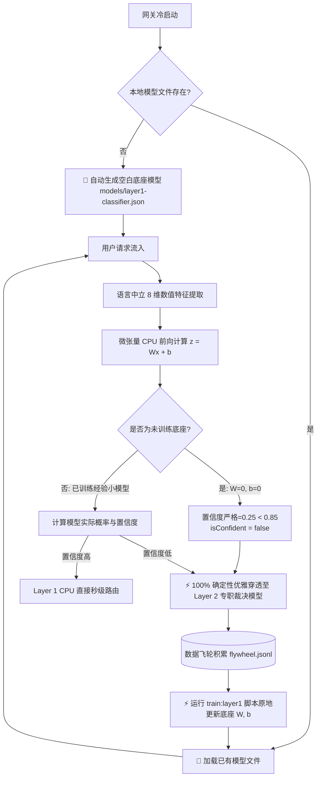

# ADR-0005: 本地空白底座模型自动初始化与冷启动确定性穿透

## 状态
已接受并实现 (Accepted & Implemented) - 2026-09-29
2026-10-10 更新：3 档 → 4 档（Lite/Plus/Pro/Ultra）

## 上下文 (Context)
在贯彻“**硬编码一切擦除，全靠模型决策，严格遵守 i18n 语言中立**”的架构原则时，系统面临冷启动期的关键挑战：
1. **避免假分支与空判断**：若 Layer 1 仅是 `if (!file) return false` 的空分支，则缺乏物理承载实体，无法在运行时作为模型统一接入；
2. **拒绝基于字数或字典的启发式规则**：字数极短的 Prompt（如 `P=NP?`）往往要求极高思考能力，长文本（如日志过滤）可能仅需极简提取，绝不能用字符数或关键词词典去代替模型；
3. **确定性穿透保证**：系统需要自动生成一个结构合规、可执行前向计算的“本地空白模型底座（Scaffold Base Model）”，即使调用执行，其数学置信度也必须必然不足，100% 确定性穿透到 Layer 2（专职判决模型或 OpenCode 代理）。

## 决策 (Decision)

### 1. 本地微张量底座规范 (Micro-Tensor Base Scaffold)
采用标准 JSON 格式构建纯 CPU 轻量张量底座，零外部 C++ 本地编译依赖，跨 Windows/macOS/Linux 及 Bun/Node 全平台即启即用：
- **特征维度**：8 维纯统计结构化数值特征，完全语言无关：
  1. `token_count_normalized`: 对数平滑 Token 规模
  2. `turn_count_normalized`: 对话轮次深度
  3. `has_system_prompt`: 系统角色指令存在性 (0/1)
  4. `code_block_ratio`: 代码块字符比率
  5. `syntax_symbol_density`: 语法结构符号密度 (`{}<>=;`)
  6. `has_tools_or_schema`: 协议层约束标志
  7. `character_entropy`: 香农字符信息熵（高熵对应算法/公式，低熵对应日常会话）
  8. `punctuation_density`: 句子标点符号密度
- **底座状态**：
  - `isBaseModel: true`
  - `sampleCount: 0`
  - 权重矩阵 $W \in \mathbb{R}^{8 \times 4} = \mathbf{0}$
  - 偏置向量 $b \in \mathbb{R}^4 = \mathbf{0}$

### 2. 自动初始化机制 (Auto-Initialization on Boot)
在网关启动或 `Layer1Classifier.init()` 执行时：
1. 探测 `./models/layer1-classifier.json` 是否存在；
2. 若不存在，系统**自动创建目录并写入标准的空白底座模型文件**；
3. 输出日志：`[Layer1Classifier] Auto-initialized empty base model scaffold: ./models/layer1-classifier.json`；
4. 挂载加载入内存，准备好接受前向张量计算。

### 3. 数学确定性穿透 (Deterministic Cascade to Layer 2)
对于未训练的底座模型，前向推理计算：
$$z = W^T x + b = \mathbf{0}$$
$$\text{Softmax}(z) = \left[\frac{e^0}{4}, \frac{e^0}{4}, \frac{e^0}{4}, \frac{e^0}{4}\right] = [0.25, 0.25, 0.25, 0.25]$$
- 最大置信度仅为 $0.25$；
- 默认置信度门限阈值 $\theta = 0.85$；
- 因 $0.25 < 0.85$，`isConfident` 在**数学上严格恒为 `false`**；
- 缺省绑定安全质量基线：`targetTier: 'plus'`（绝不会因为字数少而擅自降级给 Lite 小模型）；
- `routeAsync` 依据 `!isConfident`，**100% 确定性直接级联至 Layer 2（TypeSafe Jev / OpenCode 判决模型）**。

### 4. 数据飞轮闭环自进化 (In-Place Distillation)
空白底座并非死代码，而是可生长的物理实体：
- 运行时所有经过 Layer 2 裁决与运行验证的数据实时流入 `data/flywheel.jsonl`；
- 运行 `bun run scripts/train-layer1-classifier.ts`（或 `bun run train:layer1`）；
- 使用 Softmax 交叉熵与 L2 正则化就地训练更新 $W$ 与 $b$，并将 `isBaseModel` 改为 `false`；
- 进化后的经验模型对高频模式输出 $>0.85$ 高置信度，开始在 Layer 1 CPU（0.1ms）直接出分流决策！

## 后果与影响 (Consequences)
- **正面影响**：
  - 彻底消除了代码中关于语言、字典、字数的任何硬编码；
  - 实现了本地模型的物理实体化，冷启动即拥有完整工程链路；
  - 具备 100% 预测性的数学行为，冷启动期所有复杂语义均由成熟判决模型处理；
  - 为未来本地小模型的离线训练与渐进替换留出极度平滑的更新接口。
